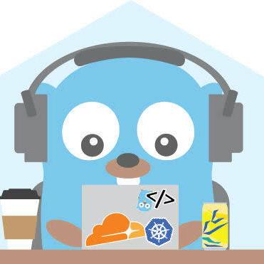

# GOLang Repository for Study Propose

  

The main objective of this repository it is to concentrate a lot of stuff about GO (golang) as a source of references.

## Table of Contents:

- [GOLang](#golang)
- [Shell](#shell)

## GOLang

- [Hack](./hack) _(label: hack)_   Example os GO Routines that send requests to an URL
- [TSE2022](./tse2022) _(label: tse2022)_   TSmall program that collects data from Tribunal Superior Eleitoral of Brazil and print the results.

## Shell

- [Shell](./shell) _(label: shell)_   Shell scripts that has a lot of stuffs to help daily dev taks

## Thanks to GitHub Sponsors

<table><tr><td align="center"><a href="https://github.com/bplusitbr"> <b>BPLust IT</b></a></td></tr></table>
